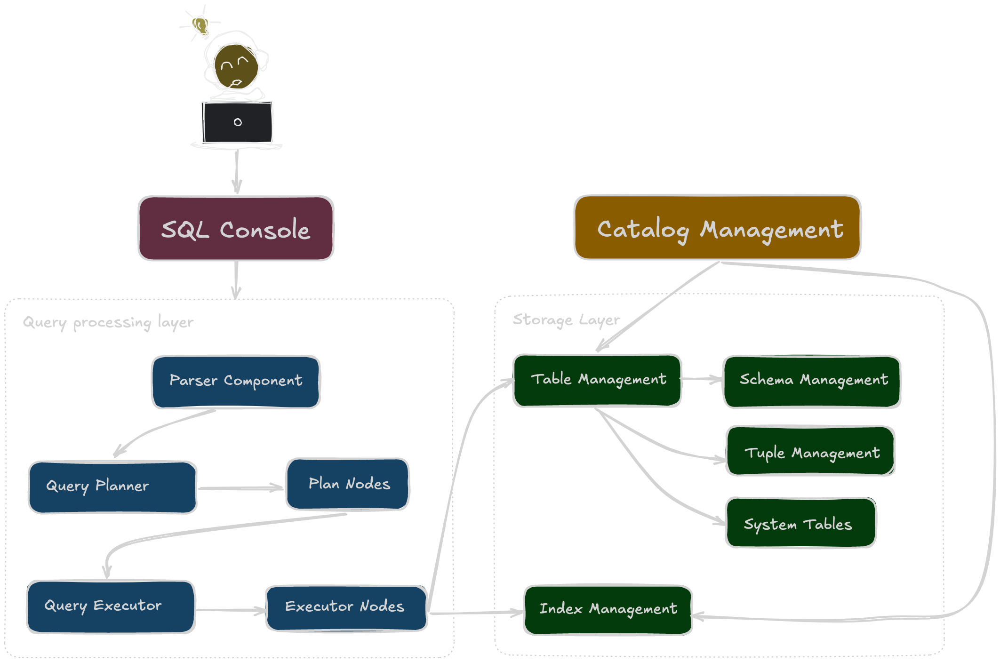

# Mini Database Project

This is a simple toy database application that accepts SQL queries in an interactive console

---

## Prerequisites

- [Docker](https://www.docker.com/) installed on your machine.

---

## How to Build

1. Clone the repo:

```bash
git clone https://github.com/Vovinsa/vovinquity.git
```

2. Navigate into the project directory:

```bash
cd vovinquity
```

3. Build the Docker image:

```bash
docker build -t database .
```

This will create a Docker image named `database`

---

## How to Run

```bash
docker run -it --rm database
```

Once the container starts, you will see a prompt like:

```
Welcome to mini DB vovinquity!
Type EXIT or QUIT to stop.

sql>
```

From here, you can enter SQL-like commands. Type `EXIT` or `QUIT` to terminate the application (or press `Ctrl+C`)

---

## Supported commands

Planner currently recognizes the following plan node types:
- `CREATE TABLE`
- `INSERT`
- `SELECT`
- `ORDER BY`
- `GROUP BY`
- `WHERE`
- Aggregates: `COUNT`, `AVG`, `SUM` 

---

## Schema




